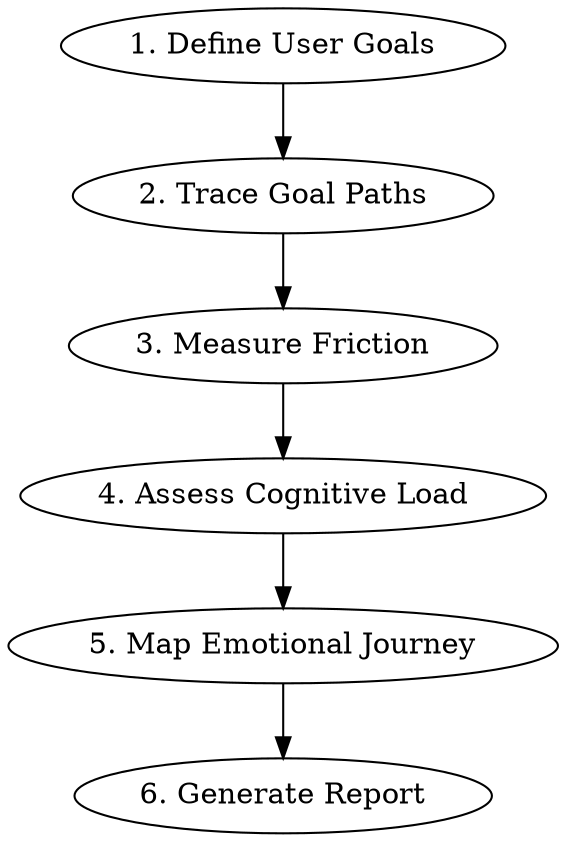

# UX Flow Analysis

## Overview

Analyze application flows from an unbiased outsider perspective, identifying friction points, cognitive load issues, and improvement opportunities that creators miss due to familiarity bias.

**Core principle:** You see the app fresh. The creator cannot. Your value is systematic analysis of what users actually experience, not surface-level design critique.

## When to Use

- Creator asks for UX/UI feedback on their app
- Testing user flows before launch
- Identifying why users drop off or get confused
- Comparing actual experience vs intended experience
- Accessibility audit needed alongside UX review

## Analysis Framework



### Phase 1: Define User Goals

Before touching the app, identify 3-5 primary user goals:
- What does a user come here to DO?
- What's the business's desired action?

Example goals for a consulting site:
- "Book a consultation"
- "Understand what services are offered"
- "Verify credibility/trustworthiness"
- "Find contact information"

### Phase 2: Trace Goal Paths

For EACH goal, walk through as a real user:

1. **Start from entry point** (homepage, landing page, etc.)
2. **Document every step** needed to achieve the goal
3. **Count interactions**: clicks, scrolls, form fields, page loads
4. **Note decision points**: where user must choose between options
5. **Identify dead ends**: paths that don't lead to goal completion

**Record format:**
```
Goal: [User goal]
Path: Entry → Step 1 → Step 2 → ... → Goal achieved
Clicks: X | Scrolls: Y | Time estimate: Z seconds
Decision points: [list]
Blockers found: [list]
```

### Phase 3: Measure Friction

At each step, evaluate friction sources:

| Friction Type | Look For |
|---------------|----------|
| **Visual friction** | Unclear CTAs, poor contrast, hidden elements |
| **Cognitive friction** | Jargon, ambiguous labels, too many choices |
| **Interaction friction** | Extra clicks, slow loads, broken flows |
| **Trust friction** | Missing credibility signals, unclear pricing |
| **Mobile friction** | Touch targets too small, content truncated |

**Friction scoring:**
- 0 = Seamless
- 1 = Minor annoyance
- 2 = Noticeable slowdown
- 3 = Likely abandonment point

### Phase 4: Assess Cognitive Load

For each screen/state, evaluate:

1. **Information density**: How much must user process at once?
2. **Decision complexity**: How many choices? Are they clear?
3. **Memory requirements**: Must user remember info from previous steps?
4. **Learning curve**: Does it match user expectations for this type of app?

**Red flags:**
- More than 7 items requiring attention
- Unclear hierarchy (what's most important?)
- Inconsistent patterns between sections
- Required knowledge not provided in context

### Phase 5: Map Emotional Journey

At each major step, assess user's likely emotional state:

| Stage | Questions to Ask |
|-------|------------------|
| **Entry** | First impression? Does it match expectations? |
| **Exploration** | Confident or lost? Clear next steps? |
| **Decision** | Informed or uncertain? Trust established? |
| **Action** | Easy or frustrating? Feedback provided? |
| **Completion** | Satisfied? Clear what happens next? |

Look for:
- Anxiety points (unclear outcomes, commitment without info)
- Delight opportunities (exceed expectations)
- Frustration triggers (broken promises, wasted effort)

### Phase 5.5: Accessibility Quick-Check

Essential accessibility factors affecting UX:

| Check | Look For |
|-------|----------|
| **Keyboard navigation** | Can user Tab through all interactive elements? |
| **Focus indicators** | Visible focus state on buttons/links? |
| **Color contrast** | Text readable? Don't rely solely on color? |
| **Screen reader hints** | Proper headings hierarchy? Alt text? ARIA labels? |
| **Touch targets** | Minimum 44x44px on mobile? |

Note: This is a UX-focused check, not a full WCAG audit.

### Phase 6: Generate Report

Structure your output:

```markdown
# UX Flow Analysis: [App/Site Name]

## Executive Summary
[3-4 sentences: overall assessment, critical issues, main opportunities]

## User Goals Analyzed
1. [Goal] - Success path: Easy/Moderate/Difficult
2. [Goal] - Success path: Easy/Moderate/Difficult
...

## Flow Maps
[For each goal, show the path with friction points marked]

## Critical Issues (Fix Immediately)
| Issue | Location | Impact | Recommendation |
|-------|----------|--------|----------------|
| ... | ... | ... | ... |

## High-Priority Improvements
[Issues that significantly impact UX but aren't breaking]

## Quick Wins
[Low-effort changes with noticeable improvement]

## Detailed Findings

### Goal 1: [Name]
- Path analysis
- Friction points
- Emotional journey
- Specific recommendations

[Repeat for each goal]

## Before/After Recommendations
[Specific changes with descriptions of improved state]

## Appendix: Screenshots/Evidence
[Reference specific snapshots taken during analysis]
```

## Interaction Methods

Use whatever is available:

**Playwright browser (preferred):**
- Actually navigate the app
- Test real interactions
- Capture snapshots at each step
- Check mobile viewport (resize to 375x812)

**Screenshots:**
- Analyze provided images
- Request additional screens if flow is unclear
- Note what you cannot assess (interactions, load times)

**Code review:**
- Trace navigation structure
- Identify component patterns
- Note: Cannot assess visual polish or real user experience

## Common Mistakes to Avoid

| Mistake | Instead |
|---------|---------|
| Surface-level design critique | Trace actual user journeys |
| Generic advice ("add testimonials") | Specific placement and format |
| Listing problems without priority | Rank by user impact |
| Missing mobile testing | Always test mobile viewport |
| Assuming user knowledge | Evaluate as complete newcomer |
| Focusing only on problems | Note what works well too |
| Skipping accessibility | Always do the quick-check |
| No effort estimates on fixes | Include Low/Medium/High effort |

## Quality Checklist

**You MUST check off each item in your report. Do not deliver without completing this.**

Before delivering analysis:

- [ ] Defined 3-5 concrete user goals
- [ ] Traced complete path for each goal
- [ ] Counted clicks/steps for each path
- [ ] Tested mobile viewport (375x812)
- [ ] Identified friction at each decision point (with scores)
- [ ] Assessed cognitive load per screen
- [ ] Completed accessibility quick-check
- [ ] Mapped emotional journey
- [ ] Prioritized recommendations by impact AND effort
- [ ] Provided specific before/after guidance
- [ ] Included evidence (snapshots, specific locations)

**Include the completed checklist in your report's appendix.**
